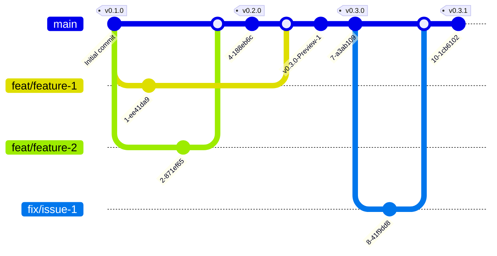

# Contributing to DataSanitizer
We love your input! We want to make contributing to this project as easy and transparent as possible, whether it's:

- Reporting a bug
- Discussing the current state of the code
- Submitting a fix
- Proposing new features
- Becoming a maintainer

## We Develop with GitHub
We use GitHub to host code, to track issues and feature requests, as well as accept pull requests.

## We Use [GitHub Flow](https://docs.github.com/en/get-started/using-github/github-flow), So All Code Changes Happen Through Pull Requests

Pull requests are the best way to propose changes to the codebase (we use [GitHub Flow](https://docs.github.com/en/get-started/using-github/github-flow)). We actively welcome your pull requests:

1. Fork the repo and create your branch from `main`.
2. If you've added code that should be tested, add tests.
3. If you've changed APIs, update the documentation.
4. Ensure the test suite passes.
5. Make sure your code lints.
6. Issue that pull request!

>[!important]
> Please adheres to [Semantic Versioning](https://semver.org/spec/v2.0.0.html) for your commit

## Any contributions you make will be under the MIT Software License
In short, when you submit code changes, your submissions are understood to be under the same [MIT License](http://choosealicense.com/licenses/mit/) that covers the project. Feel free to contact the maintainers if that's a concern.

## Report bugs using Github's [issues](https://github.com/fslef/DataSanitizer/issues)
We use GitHub issues to track public bugs. Report a bug by [opening a new issue](https://github.com/fslef/DataSanitizer/issues); it's that easy!

## Write bug reports with detail, background, and sample code

**Great Bug Reports** tend to have:

- A quick summary and/or background
- Steps to reproduce
  - Be specific!
  - Give sample code if you can
- What you expected would happen
- What actually happens
- Notes (possibly including why you think this might be happening, or stuff you tried that didn't work)

People *love* thorough bug reports. I'm not even kidding.

## Use a Consistent Coding Style
Don't worry about this, if you are using vscode, every coding rules and code litning extensions are already configured in the [vscode/settings.json](.vscode/settings.json)

## License
By contributing, you agree that your contributions will be licensed under its MIT License.
